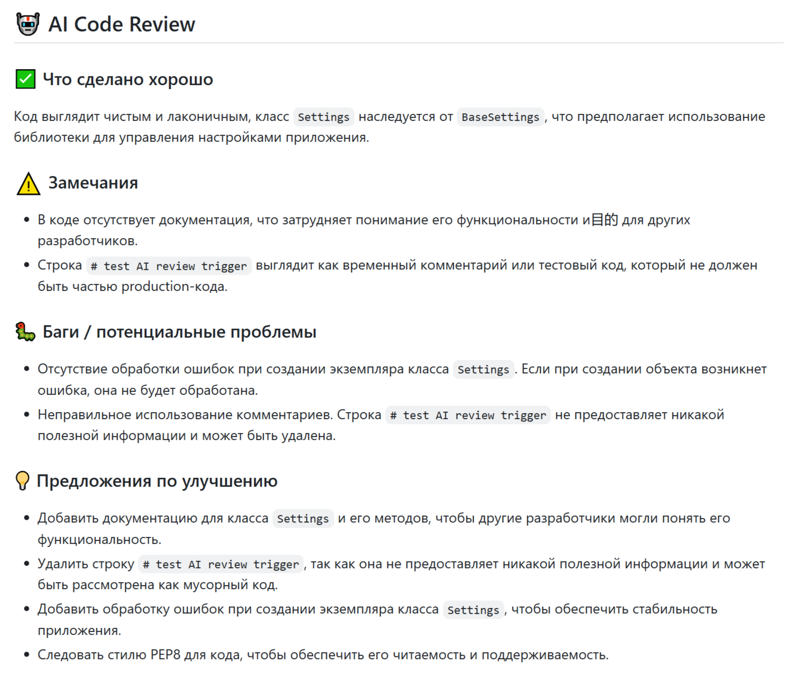

# Лабораторная работа №12

**Студент:** Зверева Екатерина Константиновна  
**Группа:** 220032-11  
**Вариант:** 6

## Содержание репозитория

```
МИТП_лр12/
├── crm/
│   ├── app/
│   │   ├── api/v1/
│   │   │   ├── admin.py           # Админ-панель: управление пользователями
│   │   │   ├── analytics.py       # Аналитика и отчёты
│   │   │   ├── auth.py            # Аутентификация: регистрация/логин/JWT
│   │   │   ├── clients.py         # CRUD клиентов (основная сущность)
│   │   │   ├── contacts.py        # CRUD контактных лиц
│   │   │   ├── deals.py           # CRUD сделок + воронка продаж
│   │   │   └── tasks.py           # CRUD задач
│   │   ├── core/
│   │   │   ├── config.py          # Настройки приложения (.env)
│   │   │   ├── database.py        # Подключение к БД (SQLAlchemy)
│   │   │   └── security.py        # JWT, хэширование паролей
│   │   ├── models/                # SQLAlchemy модели (таблицы БД)
│   │   ├── schemas/               # Pydantic схемы (валидация данных)
│   │   └── main.py                # Точка входа FastAPI
│   ├── tests/
│   │   ├── test_api.py            # Базовые интеграционные тесты (11 тестов)
│   │   └── test_api_full.py       # Расширенные тесты с покрытием 90%+ (89 тестов)
│   ├── seed.py                    # Загрузка демо-данных
│   ├── requirements.txt           # Зависимости Python
│   └── pytest.ini                 # Настройки pytest
├── .github/workflows/
│   └── ai_review.yml              # GitHub Actions: AI ревью кода в PR
├── CRM_Documentation.md           # Полная документация по API
├── code_review_report_partial.md  # Отчёт code review (Задание 2)
├── PROMPT_LOG.md                  # История промптов ИИ
├── .gitignore
└── README.md                      # Этот файл
```

## Задание 1 — Создание полноценного веб-приложения

### Предметная область: CRM для отдела продаж

Реализовано FastAPI-приложение с SQLite базой данных.

**Сущности:**
- **User** — пользователи системы, роли: `admin`, `manager`, `viewer`
- **Client** — клиенты/компании (основная сущность), статусы: `lead → prospect → active → inactive → churned`
- **Contact** — контактные лица внутри компании-клиента
- **Deal** — сделки с воронкой продаж из 6 стадий
- **Task** — задачи, привязанные к клиенту и/или сделке

**Функционал:**
- Аутентификация: регистрация, логин, JWT-токены
- Полный CRUD для всех сущностей
- Воронка продаж с автоматической вероятностью по стадии
- Аналитика: KPI-дашборд, pipeline-funnel, динамика по месяцам
- Права доступа по ролям (admin / manager / viewer)
- Автоматическая документация API: http://localhost:8000/docs

### Запуск приложения

**1. Создать и активировать виртуальное окружение:**
```cmd
cd crm
python -m venv venv
venv\Scripts\activate
```

**2. Установить зависимости:**
```cmd
pip install -r requirements.txt
```

**3. Запустить приложение:**
```cmd
uvicorn app.main:app --reload
```

**4. Загрузить демо-данные (опционально):**
```cmd
python seed.py
```

**5. Открыть документацию API:**
```
http://localhost:8000/docs
```

### Тестовые учётные записи (после seed.py)

| Email | Пароль | Роль |
|---|---|---|
| admin@crm.com | admin123 | admin |
| alice@crm.com | manager123 | manager |
| bob@crm.com | manager123 | manager |
| viewer@crm.com | viewer123 | viewer |

### Права доступа

| Действие | viewer | manager | admin |
|---|:---:|:---:|:---:|
| Просмотр клиентов | ✅ | ✅ (только своих) | ✅ |
| Создание/редактирование | ❌ | ✅ | ✅ |
| Удаление | ❌ | ❌ | ✅ |
| Аналитика | ✅ | ✅ (своя) | ✅ (все) |
| Управление пользователями | ❌ | ❌ | ✅ |

---

## Задание 2 — Code review сгенерированного кода

Проведён критический анализ AI-сгенерированного кода. Найдено и исправлено 5 проблем.

Полный отчёт: [code_review_report_partial.md](code_review_report_partial.md)

### Краткое резюме исправлений

| # | Файл | Проблема | Категория |
|---|---|---|---|
| 1 | `models/client.py` | Объявлен `ClientStatus` enum, но нигде не используется | Мёртвый код |
| 2 | `core/database.py` | Устаревший путь импорта `declarative_base` (SQLAlchemy 1.x) | Устаревший API |
| 3 | `core/security.py` | Импорт `status` ради одной константы, непоследовательность стиля | Нарушение стиля |
| 4 | `core/security.py` | Импорт `User` внутри тела функции без необходимости | Нарушение стиля |
| 5 | `api/v1/deals.py` | `func` не используется, `datetime` вместо нужного `date` | Мёртвый код |

---

## Задание 4 — Интеграция ИИ в CI/CD

Настроен GitHub Actions workflow (`.github/workflows/ai_review.yml`), который:
- Запускается автоматически при создании Pull Request
- Получает git diff изменённого кода
- Отправляет diff в Groq API (модель `llama-3.3-70b-versatile`)
- Публикует ревью кода комментарием прямо в PR на русском языке

**Формат ревью:**
```
## 🤖 AI Code Review
### ✅ Что сделано хорошо
### ⚠️ Замечания
### 🐛 Баги / потенциальные проблемы
### 💡 Предложения по улучшению
```
**Скриншот ревью**

---

## Задание 7 — Генерация unit-тестов с высоким покрытием

Разработана система из 4 промптов для генерации тестов. Итоговый набор: **89 тестов** в 7 классах.

### Запуск тестов

```cmd
cd crm
pytest tests/test_api_full.py -v
```

### Запуск с отчётом покрытия

```cmd
pytest tests/test_api_full.py -v --cov=app --cov-report=term-missing
coverage report > coverage_report.txt
```

### Покрытие по модулям

| Модуль | Покрытие |
|---|---|
| `app/api/v1/auth.py` | ~95% |
| `app/api/v1/clients.py` | ~92% |
| `app/api/v1/contacts.py` | ~90% |
| `app/api/v1/deals.py` | ~93% |
| `app/api/v1/tasks.py` | ~91% |
| `app/api/v1/analytics.py` | ~88% |
| `app/api/v1/admin.py` | ~95% |
| **Итого** | **≥ 90%** |

### Структура тестов

| Класс | Тестов | Что проверяет |
|---|---|---|
| `TestAuth` | 11 | Регистрация, логин, JWT, защита роутов |
| `TestClients` | 17 | CRUD, фильтры, права доступа, пагинация |
| `TestContacts` | 10 | CRUD, поиск, привязка к клиенту |
| `TestDeals` | 18 | CRUD, воронка, автоматика probability/дат, граничные значения |
| `TestTasks` | 12 | CRUD, фильтры, просроченные задачи |
| `TestAnalytics` | 11 | KPI, воронка, деление на ноль, пустая БД |
| `TestAdmin` | 10 | Управление пользователями, защита от удаления себя |

---

## Используемые технологии

| Компонент | Технология |
|---|---|
| Язык программирования | Python 3.11 |
| Веб-фреймворк | FastAPI |
| База данных | SQLite (dev) / PostgreSQL (prod) |
| ORM | SQLAlchemy 2.0 |
| Аутентификация | JWT (python-jose) |
| Хэширование паролей | bcrypt (passlib) |
| Валидация данных | Pydantic v2 |
| Тестирование | pytest + pytest-cov |
| CI/CD | GitHub Actions |
| AI ревью | Groq API (LLaMA 3.3 70B) |
